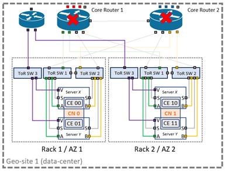

# DSTW Split Brain - Technical Analysis

**Date:** 2026-09-28  
**Scope:** Preliminary safety and RAM assessment of the DIL-CU Split Brain risk and the independent supervision-channel proposal.  
**Status:** Engineering assessment for decision preparation; not a final safety case or architecture approval.

## 1. Executive conclusion

The Split Brain hazard remains credible for the 4x2oo2 geographically redundant configuration when the communication view of the two geo-sites is inconsistent. The most consequential cases are:

- simultaneous loss of the inter-site communication paths;
- loss or restart of both core routers at one site; and
- recovery or reintegration while more than one site can elect a master.

The independent TAS Platform supervision channel is technically feasible and is the strongest currently documented mitigation for these cases. It should proceed to detailed design and validation as the preferred safety mitigation, while the existing Master Token Protocol, Master Confirm Interface, and startup observer mechanisms remain part of the overall defence.

This is not yet an approved solution. The proposal remains subject to hardware selection, topology qualification, availability and CCF substantiation, exposure-time confirmation, ECMUX assessment, and management acceptance of cost and lifecycle impact.

## 2. Hazard and failure mechanism

The NMR architecture requires exactly one Master Computing Node at any time. A network partition can make an active master appear lost to an isolated subgroup. If that subgroup elects a new master, both subgroups may continue to communicate with external equipment independently. The hazardous condition is therefore not only the initial router or link failure; it is the subsequent master election and network reintegration.

The TAS Platform controls documented in the source material have different coverage:

### Table 2.1 - TAS Platform Split Brain controls

| Control | Main coverage | Limitation requiring confirmation |
| --- | --- | --- |
| Master Token Protocol | Allows election when a valid master-shutdown token is received | Does not resolve a simultaneous loss that prevents the token from being sent or received |
| Master Confirm Interface | Allows an application-specific safety decision before master election | Decision logic, independence, and safety evidence are not yet defined here |
| Independent supervision channel | Compares master state received over a physically separate path with NMR state | It must remain independent in power, hardware, routing, geography, and failure causes |
| Startup observer | Prevents conflicting master selection during startup | Does not by itself establish the state of a running partitioned network |

## 3. Proposed architecture

The latest proposal adds:

- a third, standalone ToR switch for the supervision channel;
- a dedicated mini-router with MACsec capability;
- a physically separate supervision interface on each server blade;
- separate inter-site links for NMR sync channel A, NMR sync channel B, ServiceLink, and supervision; and
- a supervision route via the third location (Wels), without dynamic mixing or rerouting between ServiceLink and supervision traffic.

The proposal states that the supervision channel prevents a slave CN from becoming master when the main NMR network is partitioned. It also states that the channel improves recovery and availability behaviour for core-router outages and transient router reboots. These claims require confirmation by a final fault tree and representative integration tests.

The proposal does not improve safety inside a data centre if the reference two-channel design already prevents the relevant double-fault hazard. Its principal safety benefit is for loss or transient unavailability of the main inter-site/core-router paths. The additional device and ServiceLink routing also introduce availability and maintainability trade-offs.

## 4. RAM calculation review

### 4.1 Inputs from the preliminary workbook

#### Table 4.1 - Preliminary RAM calculation inputs

| Input | Value | Comment |
| --- | ---: | --- |
| Core-router failure rate | 9,600 FIT per router | Workbook input |
| ToR-switch failure rate | 7,000 FIT per switch | Workbook input |
| Geo-sites | 2 | Workbook input |
| Availability zones per site | 3 | Workbook input |
| Partition-creating combinations | 6 | 2 crossed combinations x 3 cabinets |
| Split Brain allocated probability | 0.000001 | 10% allocation of IPS unavailability 0.00001 |
| Mixed core-router/ToR CCF factor | 0 | Assumes different device types, locations, and supplies |
| MTTR cases | 1, 4, 8, 12, 24, 72 h | Sensitivity analysis |

For one crossed core-router/ToR combination, the workbook uses:

$$
lambda_{sys} = lambda_{CR} U_{ToR} + lambda_{ToR} U_{CR}
$$

with:

$$
U = lambda x MTTR
$$

This is valid only where the first failure is detected and restored within the stated MTTR. For latent failures, the exposure term must instead use the relevant proof-test or diagnostic interval.

### 4.2 Results

#### Table 4.2 - Mixed core-router/ToR partition exposure

| MTTR | Mixed partition exposure, both sites | Share of 0.000001 budget | Independent double-core-router exposure, one pair |
| ---: | ---: | ---: | ---: |
| 8 h | 1.63 s/year | 5.16% | 0.37 s/year |
| 24 h | 14.65 s/year | 46.45% | 3.35 s/year |
| 72 h | 131.83 s/year | 418.04% | 30.13 s/year |

The independent double-core-router case is not the dominant contributor at the stated 8-hour MTTR. The mixed core-router/ToR partition mechanism is more significant in the workbook model. At 72 hours, however, the mixed mechanism exceeds the allocated budget; therefore the 8-hour assumption must not be treated as an administrative value. Detection, dispatch, repair, and restoration controls need to be demonstrated.

The workbook separately treats common-cause failure of the two identical core routers using a 2% factor. This path must remain separate from the mixed-device calculation, which assumes beta = 0. The CCF factor, its scoring basis, and the allocation of external geolink CCF require formal justification before the result can support a safety claim.

### 4.3 Core-router 1oo2 sensitivity with and without CCF

This sensitivity calculation uses 10,000 FIT per core router, as a separate assumption from the 9,600 FIT workbook input. The two core routers are modelled as an active 1oo2 hot-redundant pair with perfect failure detection and switchover, identical MTTR, exponential failure behaviour, and restoration to full redundancy after repair. The low-unavailability approximations below are appropriate for comparison but do not replace a final Markov model or fault tree.

For each core router:

$$
\lambda = \frac{10{,}000}{10^9} = 1.0 \times 10^{-5}\ \mathrm{h^{-1}}
$$

#### Independent failures only

Without CCF, system loss requires the second router to fail while the first router is under repair. The approximate system failure rate is:

$$
\lambda_{sys,ind} = 2\lambda^2 MTTR
$$

The corresponding RAM parameters are:

$$
MTBF_{sys} = \frac{1}{\lambda_{sys,ind}}
$$

$$
U_{ind} \approx \lambda_{sys,ind}MTTR = 2(\lambda MTTR)^2
$$

$$
A = 1-U, \qquad DT = U \times 525{,}600\ \mathrm{min/year}
$$

##### Table 4.3 - 1oo2 core-router pair without CCF

| MTTR (h) | $\lambda_{sys}$ (FIT) | MTBF (h) | MTBF (y) | Availability (%) | Unavailability | Downtime (min/y) |
| ---: | ---: | ---: | ---: | ---: | ---: | ---: |
| 1 | 0.2 | 5000000000 | 570776 | 0.9999999998 | 0.0000000002 | 0.000105 |
| 4 | 0.8 | 1250000000 | 142694 | 0.9999999968 | 0.0000000032 | 0.001682 |
| 8 | 1.6 | 625000000 | 71347 | 0.9999999872 | 0.0000000128 | 0.006728 |
| 12 | 2.4 | 416666666.667 | 47565 | 0.9999999712 | 0.0000000288 | 0.015137 |
| 24 | 4.8 | 208333333.333 | 23782 | 0.9999998848 | 0.0000001152 | 0.060549 |

#### Including CCF with beta = 0.02

The beta-factor model assumes that 2% of each router's failure rate is associated with causes capable of failing both routers together. The CCF and remaining independent rates are:

$$
\lambda_{CCF} = \beta\lambda = 0.02(1.0 \times 10^{-5})
= 2.0 \times 10^{-7}\ \mathrm{h^{-1}} = 200\ FIT
$$

$$
\lambda_{ind} = (1-\beta)\lambda = 9.8 \times 10^{-6}\ \mathrm{h^{-1}}
$$

A CCF causes immediate loss of both redundant routers, whereas the independent contribution still requires two failures within the repair interval. The combined system failure rate and unavailability are therefore approximated by:

$$
\lambda_{sys} = \lambda_{CCF} + 2\lambda_{ind}^{2}MTTR
$$

$$
U_{sys} \approx \lambda_{sys}MTTR
$$

##### Table 4.4 - 1oo2 core-router pair including CCF

| MTTR (h) | $\lambda_{sys}$ (FIT) | MTBF (h) | MTBF (y) | Availability (%) | Unavailability | Downtime (min/y) |
| ---: | ---: | ---: | ---: | ---: | ---: | ---: |
| 1 | 200.192 | 4995202.607 | 570.23 | 0.9999997998 | 0.0000002002 | 0.1052 |
| 4 | 200.768 | 4980865.507 | 568.59 | 0.9999991969 | 0.0000008031 | 0.4221 |
| 8 | 201.537 | 4961876.907 | 566.42 | 0.9999983877 | 0.0000016123 | 0.8474 |
| 12 | 202.305 | 4943032.539 | 564.27 | 0.9999975723 | 0.0000024277 | 1.2760 |
| 24 | 204.610 | 4887348.570 | 557.92 | 0.9999950894 | 0.0000049106 | 2.5810 |

### 4.3.1 Exposure questions and answers

The following answers use an 8-hour MTTR as the reference case and assume that the purple mini-router/supervision link remains available and correctly performs its master-election prevention function. The exposure values are expected accumulated exposure per year; the duration of an individual event is represented by the assumed MTTR.

#### Question 1: Both big core routers are down due to independent faults while the mini-router remains available. What is the exposure?

> **Answer:** For an 8-hour MTTR, the expected accumulated exposure is **0.00646 min/year**, equivalent to approximately **0.39 seconds/year**. The independent both-core-router failure rate is **1.537 FIT**.

Because the purple supervision channel remains available, this condition should result in a blocked or controlled master-election state rather than an active Split Brain, provided the supervision channel is independent, correctly monitored, and correctly configured.

#### Question 2: What is the exposure for a common-cause failure of both big core routers while the mini-router remains available?

> **Answer:** For an 8-hour MTTR and a beta factor of 0.02, the expected accumulated exposure is **0.84096 min/year**, equivalent to approximately **50.46 seconds/year**. The common-cause failure rate is **200 FIT**.

The CCF exposure is approximately **130 times higher** than the independent-failure exposure at 8-hour MTTR. The available purple supervision channel is therefore safety-significant: it should prevent the core-router CCF from directly developing into a dual-master Split Brain condition. If the mini-router or purple link also fails, this becomes a separate combined-failure case and must be assessed independently.

#### CCF relevance to Split Brain

Without CCF, the 1oo2 architecture benefits from the very low probability that two independent router failures overlap during MTTR. With a 2% beta factor, the 200 FIT CCF term is already much larger than the independent double-failure rate of 0.2 to 4.8 FIT over the evaluated MTTR range. For an 8-hour MTTR, including CCF increases estimated downtime from 0.0067 to 0.8474 min/year, by approximately a factor of 126, and reduces MTBF from about 71,347 years to 566 years.

CCF is relevant because identical core routers can share firmware, configuration, management actions, environmental conditions, power dependencies, maintenance errors, or systematic defects. Such causes can defeat both channels simultaneously and bypass the protection expected from 1oo2 redundancy. In the Split Brain context, simultaneous core-router loss or reboot can partition the network and create the precondition for conflicting master election, particularly during recovery and reintegration.

The 2% beta factor is an assumption, not a demonstrated property of the design. It must be justified by a documented CCF assessment covering physical and functional separation, diversity, power, environment, communications, configuration, maintenance, diagnostics, and test evidence. The result also shows why reducing MTTR alone cannot adequately control CCF: MTTR reduces CCF downtime, but the approximately 200 FIT occurrence rate remains. Prevention and mitigation therefore require design independence and a genuinely separate supervision path in addition to restoration controls.

### 4.4 Combined failure of both core routers and the single router

The topology includes two core routers in 1oo2 hot redundancy and one additional single router. The network is considered failed only when both core routers and the single router are unavailable at the same time.

**Combined-failure statement:** The failure condition assessed in this section is a double fault of the 1oo2 core-router subsystem (Core Router 1 and Core Router 2 unavailable) combined with a separate single fault of the additional single router. Loss of both core routers alone does not produce the defined total network failure while the single router remains available; the additional router failure must overlap in time with the core-router double fault.

The calculation uses 10,000 FIT for each core router and 3,500 FIT for the single router. All MTTRs are assumed equal, the failures are assumed independent unless CCF is explicitly included, and the duration of the combined unavailable state is approximated by the MTTR.

#### Independent three-router failures only

The failure rates are:

$$
\lambda_{CR}=\frac{10{,}000}{10^9}=1.0\times10^{-5}\ \mathrm{h^{-1}}
$$

$$
\lambda_S=\frac{3{,}500}{10^9}=3.5\times10^{-6}\ \mathrm{h^{-1}}
$$

The combined unavailability requires both core-router failures to overlap with an unavailable single router:

$$
U_{triple,ind}\approx2(\lambda_{CR}MTTR)^2(\lambda_S MTTR)
$$

The equivalent combined failure rate is:

$$
\lambda_{triple,ind}=\frac{U_{triple,ind}}{MTTR}
=2\lambda_{CR}^{2}\lambda_S MTTR^2
$$

##### Table 4.5 - Combined independent failure of both core routers and the single router

| MTTR (h) | Combined failure rate (FIT) | Unavailability | Downtime (min/y) | Downtime (sec/y) |
| ---: | ---: | ---: | ---: | ---: |
| 1 | 0.0000007 | 0.0000000000000007 | 0.000000000368 | 0.0000000221 |
| 4 | 0.0000112 | 0.0000000000000448 | 0.00000002354688 | 0.0000014128128 |
| 8 | 0.0000448 | 0.0000000000003584 | 0.00000018837504 | 0.0000113025024 |
| 12 | 0.0001008 | 0.000000000001210 | 0.00000063576576 | 0.0000381459456 |
| 24 | 0.0004032 | 0.000000000009677 | 0.00000508612608 | 0.0003051675648 |

###### Example calculation for Table 4.5, MTTR = 1 h

For the independent-failure case, use $\lambda_{CR}=0.00001\ \mathrm{h^{-1}}$, $\lambda_S=0.0000035\ \mathrm{h^{-1}}$, and $T=1\ \mathrm{h}$.

Core-router 1oo2 unavailability:

$$
U_{CR}=2(\lambda_{CR}T)^2
=2(0.00001\times1)^2
=0.0000000002
$$

Single-router unavailability:

$$
U_S=\lambda_ST
=0.0000035\times1
=0.0000035
$$

Combined three-router unavailability:

$$
U_{triple,ind}=U_{CR}U_S
=0.0000000002\times0.0000035
=0.0000000000000007
$$

Combined failure rate:

$$
\lambda_{triple,ind}=\frac{U_{triple,ind}}{T}
=\frac{0.0000000000000007}{1}
=0.0000000000000007\ \mathrm{h^{-1}}
$$

Converting to FIT:

$$
\lambda_{triple,ind}=0.0000000000000007\times1{,}000{,}000{,}000
=0.0000007\ \mathrm{FIT}
$$

Downtime:

$$
DT_{min/year}=U_{triple,ind}\times8760\times60
=0.000000000368\ \mathrm{min/year}
$$

$$
DT_{sec/year}=0.000000000368\times60
=0.0000000221\ \mathrm{sec/year}
$$

At the reference MTTR of 8 hours, the expected combined-failure exposure is approximately $1.88\times10^{-7}$ min/year, or $0.000011$ seconds/year.

#### Including CCF of the two core routers with beta = 0.02

For the core-router pair:

$$
\lambda_{CCF}=0.02\times10{,}000=200\ \mathrm{FIT}
$$

The remaining independent failure rate for each core router is:

$$
\lambda_{CR,ind}=(1-\beta)\lambda_{CR}=0.98\times10{,}000=9{,}800\ \mathrm{FIT}
$$

The 200 FIT CCF term is not a second independent failure within the 1oo2 repair interval. It directly makes both core routers unavailable and therefore removes the benefit of the 1oo2 redundancy. The single router must then also be unavailable for the combined network-failure condition to occur.

The combined exposure includes the CCF path and the independent double-core-router path:

$$
U_{triple,CCF}\approx(\lambda_{CCF}MTTR)(\lambda_S MTTR)
+2(\lambda_{CR,ind}MTTR)^2(\lambda_S MTTR)
$$

where $\lambda_{CR,ind}=0.98\lambda_{CR}$. The equivalent combined failure rate is $\lambda_{triple,CCF}=U_{triple,CCF}/MTTR$.

##### Table 4.6 - Combined failure including core-router CCF and single-router failure

| MTTR (h) | Combined failure rate (FIT) | Unavailability | Downtime (min/y) | Downtime (sec/y) |
| ---: | ---: | ---: | ---: | ---: |
| 1 | 0.0007007 | 0.0000000000007007 | 0.000000368 | 0.0000221 |
| 4 | 0.002811 | 0.00000000001124 | 0.00000591 | 0.000355 |
| 8 | 0.005643 | 0.00000000004514 | 0.0000237 | 0.00142 |
| 12 | 0.008497 | 0.0000000001020 | 0.0000536 | 0.00322 |
| 24 | 0.017187 | 0.0000000004125 | 0.000217 | 0.013 |

At 8-hour MTTR, including the core-router CCF gives approximately $2.37\times10^{-5}$ min/year, or $0.00142$ seconds/year. The requirement for the independent single-router failure makes the total network-failure exposure very small; however, this conclusion depends on genuine independence of the single router from both core routers in power, hardware, environment, configuration, maintenance, and communication paths.

#### Detailed 8-hour calculation in three layers

The combined calculation can be traced in three layers. The 8-hour case is shown because it is the reference MTTR used in the preliminary RAM assessment.

##### Layer 1 - 1oo2 core-router pair with CCF

The beta-factor treatment splits the 10,000 FIT rate of each core router into a common-cause portion and an independent portion:

$$
\lambda_{CCF}=\beta\lambda_{CR}=0.02\times10{,}000=200\ \mathrm{FIT}
$$

$$
\lambda_{CR,ind}=(1-\beta)\lambda_{CR}=0.98\times10{,}000=9{,}800\ \mathrm{FIT}
$$

The CCF directly makes both core routers unavailable. It is not a second independent failure during the repair interval:

$$
U_{CR,CCF}\approx\lambda_{CCF}T
=2.0\times10^{-7}\times8
=1.60\times10^{-6}
$$

For independent failures in the hot-redundant 1oo2 pair, either core router can fail first, giving the factor 2:

$$
U_{CR,ind}\approx2(\lambda_{CR,ind}T)^2
=2(9.8\times10^{-6}\times8)^2
=1.229312\times10^{-8}
$$

Therefore, the total core-router-pair unavailability is:

$$
U_{CR}=U_{CR,CCF}+U_{CR,ind}
=1.61229312\times10^{-6}
$$

##### Layer 2 - single-router failure

The single router has a failure rate of 3,500 FIT and is not redundant in this combined-failure scenario:

$$
\lambda_S=\frac{3{,}500}{10^9}=3.5\times10^{-6}\ \mathrm{h^{-1}}
$$

For the same 8-hour repair time:

$$
U_S\approx\lambda_ST
=3.5\times10^{-6}\times8
=2.8\times10^{-5}
$$

This term is required explicitly: the loss of both core routers alone does not constitute the defined total network failure while the single router remains available.

##### Layer 3 - simultaneous overlap and combined failure rate

The defined network failure requires the core-router pair and the single router to be unavailable at the same time. Assuming independence between these two groups:

$$
U_{triple,CCF}=U_{CR}U_S
=1.61229312\times10^{-6}\times2.8\times10^{-5}
=4.514420736\times10^{-11}
$$

The equivalent combined failure rate, using the 8-hour duration assumption for the combined unavailable state, is:

$$
\lambda_{triple,CCF}
=\frac{U_{triple,CCF}}{T}
=\frac{4.514420736\times10^{-11}}{8}
=5.64302592\times10^{-12}\ \mathrm{h^{-1}}
$$

$$
\lambda_{triple,CCF}=0.005643\ \mathrm{FIT}
$$

The corresponding annual exposure is:

$$
DT=U_{triple,CCF}\times525{,}600
=0.00002373\ \mathrm{min/year}
=0.001424\ \mathrm{sec/year}
$$

The CCF contribution to the combined condition is $U_{CR,CCF}U_S=4.48\times10^{-11}$, while the independent double-core-router contribution is $U_{CR,ind}U_S=3.4420736\times10^{-13}$. Thus, even though the single-router failure is required, the CCF remains the dominant contribution within the combined network-failure calculation.

## 5. Technical findings

### Table 5.1 - Technical findings

| ID | Finding | Consequence |
| --- | --- | --- |
| F-01 | Split Brain is principally a network-partition and master-election problem, not simply a component unavailability problem. | Availability compliance alone cannot demonstrate safety. |
| F-02 | The independent supervision channel addresses the decision information needed during partition and reintegration. | It is a credible preferred mitigation, subject to independence proof. |
| F-03 | The RAM result is highly sensitive to MTTR and latent-fault assumptions. | The allocated $10^{-6}$ budget cannot be accepted without verified operational assumptions. |
| F-04 | The supervision proposal adds hardware and a new ServiceLink topology. | Safety improvement must be balanced against new availability, maintenance, and qualification failure modes. |
| F-05 | The current evidence does not include a complete final fault tree, FMEA, or test result. | No residual-risk or SIL-related conclusion can yet be closed. |

## 6. Required validation work

1. Freeze the final topology, including ToR, core-router, mini-router, Wels, power, cable, routing, and MACsec boundaries.
2. Produce a fault tree for hazardous dual-master operation, including independent failures, CCFs, transient reboots, maintenance states, and reintegration.
3. Demonstrate independence of NMR channels, supervision, ServiceLink, power, cabinets, routing, and common management functions.
4. Confirm the supervision-channel failure reaction for loss, stale messages, delayed messages, malformed messages, and restoration.
5. Define and substantiate detection time, repair time, proof-test interval, and exposure time. Recalculate the budget using the verified values.
6. Select and qualify the MACsec-capable mini-router and confirm throughput, failure rate, diagnostics, spares, and maintainability.
7. Assess ECMUX behaviour and external-equipment effects during partition, blocked election, and reintegration.
8. Test at minimum: single-router loss, dual-router loss, router reboot, ToR/core crossed failure, inter-site link combinations, Wels-link loss, stale supervision, and recovery.
9. Reconcile the final result with the applicable DIL-CU/VIL requirements and document the allocation of responsibility for external geolinks.

## 7. Decision status

The technical evidence supports continuing with the independent supervision-channel option as the preferred candidate. It does **not** support recording the architecture as approved, the Split Brain risk as closed, or the RAM allocation as demonstrated. The remaining decision is management acceptance of cost and lifecycle impact after the validation work above has produced the required safety and RAM evidence.

## Sources

- [Independent supervision-channel experimental proposal](TEP-Independentsupervisionchannel-Experimentalproposal-280926-0956-378.pdf)
- [Split Brain analysis and proposals](TEP-Split-brainanalysisandproposalsforDIL-CU-280926-0954-374.pdf)
- [Split Brain technical report](TR-SplitBrain-280926-0956-376.pdf)
- [Preliminary RAM estimation workbook](Prelim_RAM_Estimation_DSTW_Ed02_20260910.xlsx)
- [Chapter 4.4 calculation workbook](Split-Brain-Chapter-4.4-Calculations.xlsx)
